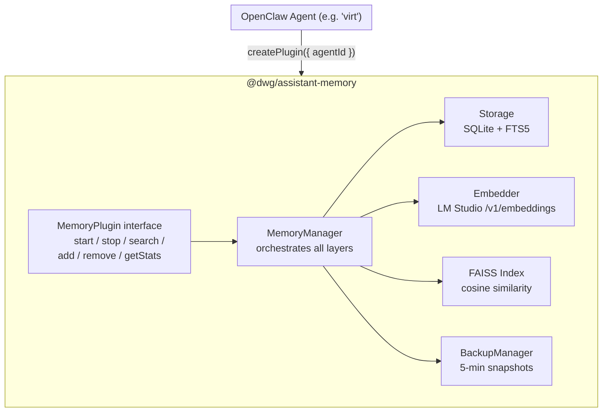

# DWG Assistant Memory Plugin

Per-agent memory system for DWG Assistants — TypeScript plugin running on Marcus's VM.

---

## OpenClaw Integration

The `assistant-memory` plugin integrates with OpenClaw as a per-agent memory plugin.
See [docs/openclaw-bootstrap.md](docs/openclaw-bootstrap.md) for full setup instructions.

**TL;DR for Virt's workspace:**

1. Add to workspace `config.json`:
```json
{
  "plugins": [
    {
      "name": "assistant-memory",
      "version": "1.0.0",
      "entry": "node_modules/@dwg/assistant-memory/src/index.js"
    }
  ]
}
```

2. Create per-agent config at `config/agents/virt/memory-plugin.json`:
```json
{
  "agentId": "virt",
  "lmStudioUrl": "http://192.168.64.1:1234",
  "embeddingModel": "text-embedding-qwen3-embedding-4b",
  "dataDir": "data/agents/virt/memory"
}
```

OpenClaw calls `createPlugin({ agentId: 'virt' })` and then `plugin.start()`. The
plugin reads the config, connects to LM Studio, and exposes `search()` / `add()` /
`remove()` / `getStats()` to the agent.

---

## Overview

Each DWG Assistant gets its own isolated memory store with:
- **SQLite + FTS5** — full-text search with BM25 ranking
- **FAISS index** — in-memory vector index for embedding similarity
- **LM Studio embeddings** — `text-embedding-qwen3-embedding-4b` model at `http://192.168.64.1:1234`
- **Periodic backup** — 5-minute interval, last 3 snapshots retained
- **Version metadata** — plugin version logged at startup (Option A, non-blocking)

## Architecture

```
┌─────────────────────────────────────────────────────────────────┐
│                        OpenClaw Agent                           │
│                      (e.g. agent "virt")                        │
└──────────────────────────┬────────────────────────────────────┘
                           │ createPlugin({ agentId })
                           ▼
┌─────────────────────────────────────────────────────────────────┐
│                    @dwg/assistant-memory                       │
│  ┌──────────────────────────────────────────────────────────┐  │
│  │                  MemoryPlugin (interface)                 │  │
│  │  start() / stop() / search() / add() / remove() / stats() │  │
│  └─────────────────────────┬────────────────────────────────┘  │
│                            │                                     │
│  ┌─────────────────────────┴───────────────────────────────┐  │
│  │                    MemoryManager                          │  │
│  │   orchestrates: storage + embedder + index + backup       │  │
│  └──────┬───────────────┬──────────────┬────────────────────┘  │
│         │               │              │                        │
│  ┌──────▼──────┐ ┌──────▼──────┐ ┌────▼──────────────┐        │
│  │  Storage    │ │  Embedder   │ │   FAISS Index      │        │
│  │  SQLite+FTS │ │ LM Studio  │ │  cosine similarity │        │
│  └──────┬──────┘ │  /v1/embed  │ └────────────────────┘        │
│         │        └─────────────┘                               │
│  ┌──────▼──────────────┐                                       │
│  │  BackupManager      │                                       │
│  │  5-min snapshots    │                                       │
│  │  last N retained    │                                       │
│  └─────────────────────┘                                       │
└─────────────────────────────────────────────────────────────────┘
```

<!-- text-diagram
OpenClaw Agent ("virt")
    │
    ▼ createPlugin({ agentId })
┌─────────────────────────────────────────────────┐
│           @dwg/assistant-memory                 │
│  ┌──────────────────────────────────────────┐   │
│  │         MemoryPlugin interface           │   │
│  │  start() / stop() / search() / add() /   │   │
│  │  remove() / getStats()                   │   │
│  └─────────────────────┬────────────────────┘   │
│                        │                         │
│  ┌─────────────────────┴───────────────────┐    │
│  │          MemoryManager                   │    │
│  │  orchestrates all layers                 │    │
│  └───┬──────────┬──────────┬───────────────┘    │
│      │          │          │                    │
│  ┌───▼──┐  ┌────▼────┐  ┌──▼────────────┐      │
│  │Storage│  │Embedder │  │ FAISS Index   │      │
│  │SQLite │  │LM Studio│  │ cosine sim    │      │
│  │ +FTS5│  │/v1/embed│  └───────────────┘      │
│  └───┬──┘  └─────────┘                         │
│      │                                          │
│  ┌───▼──────────────┐                          │
│  │  BackupManager   │                          │
│  │  5-min snapshots │                          │
│  └──────────────────┘                          │
└─────────────────────────────────────────────────┘
-->



---

## Quick Start

```typescript
import { createPlugin } from '@dwg/assistant-memory';

const plugin = await createPlugin({ agentId: 'virt' });
await plugin.start();

// Search
const results = await plugin.search('docker deployment', 5);

// Add
await plugin.add('session-123', 'User asked about Docker deployment', { tags: ['docker'] });

// Stats
const stats = await plugin.getStats(); // { count: N, lastIndexed: null }

// Shutdown
plugin.stop();
```

## Configuration

### Config File (`config/agents/{agentId}/memory-plugin.json`)

Full reference in [docs/plugin-api.md](docs/plugin-api.md).

```json
{
  "agentId": "dwg-assistant-1",
  "persona": "Code Assistant",
  "systemPrompt": "You are a helpful coding assistant.",
  "lmStudioUrl": "http://192.168.64.1:1234",
  "embeddingModel": "text-embedding-qwen3-embedding-4b",
  "dataDir": "data/agents/dwg-assistant-1/memory",
  "backupDir": "data/agents/dwg-assistant-1/memory/backups",
  "backupInterval": 300,
  "maxBackups": 3
}
```

### Environment Variables

| Variable | Description | Default |
|----------|--------------|---------|
| `AGENT_ID` | Unique agent identifier | (required) |
| `AGENT_MEMORY_CONFIG` | Path to config JSON | — |
| `AGENT_MEMORY_LM_STUDIO_URL` | LM Studio endpoint | `http://192.168.64.1:1234` |
| `AGENT_MEMORY_EMBEDDING_MODEL` | Embedding model | `text-embedding-qwen3-embedding-4b` |
| `AGENT_MEMORY_DATA_DIR` | Memory data directory | `data/agents/{agentId}/memory` |
| `AGENT_MEMORY_BACKUP_DIR` | Backup directory | `{dataDir}/backups` |
| `AGENT_MEMORY_BACKUP_INTERVAL` | Backup interval (sec) | `300` |

## Internal Architecture

```
src/
├── index.ts          # Main entry, exports everything
├── plugin.ts         # createPlugin factory + MemoryPlugin interface
├── config.ts         # Config loading from env/file + schema
├── memory.ts         # MemoryManager (orchestration layer)
├── storage.ts        # SQLite + FTS5 operations
├── embedder.ts       # LM Studio REST API client
├── faiss.ts          # FAISS vector index management
├── backup.ts         # Periodic backup scheduler
└── versioning.ts     # Plugin version logging
```

### Storage Layer (`storage.ts`)

- **memories table** — id, content, tags, source, timestamps, embedding blob
- **memories_fts** — FTS5 virtual table for full-text search
- **meta table** — key-value metadata (last_index_time, etc.)

### Embedder (`embedder.ts`)

- Calls `POST /v1/embeddings` on LM Studio
- Batch-friendly (up to `batch_size` texts per request)
- Returns raw float32 bytes packed as binary blobs

### FAISS Index (`faiss.ts`)

- In-memory vector index for cosine similarity
- **On-change**: indexes new/updated memories immediately when `addMemory`/`updateMemory` is called
- **Periodic fallback**: scans for missing embeddings every 60s (configurable via `periodicIndexMs`)

### Backup (`backup.ts`)

- Uses SQLite's native `sqlite3.backup` API for consistent snapshots
- Retains last N backups (default: 3)
- 5-minute interval (300,000ms)

### Versioning (`versioning.ts`)

- Option A (pinned) — version metadata logged at startup
- `version.ts` reads `VERSION` file and exposes `PluginVersion`
- No startup blocking — version is informational only

## API Reference

See [docs/plugin-api.md](docs/plugin-api.md) for the full interface and method signatures.

## Build & Run

```bash
npm install
npm run build
npm run typecheck
npm test
```

## Docker Integration

```bash
docker run -v $(pwd)/assistant-memory:/app/plugins/assistant-memory \
  -e AGENT_ID=dwg-assistant-1 \
  -e AGENT_MEMORY_CONFIG=/app/config/agents/dwg-assistant-1/memory-plugin.json \
  -e AGENT_MEMORY_LM_STUDIO_URL=http://host.docker.internal:1234 \
  your-dwg-image
```

## Plugin Version

**1.0.0** (from `VERSION` file)